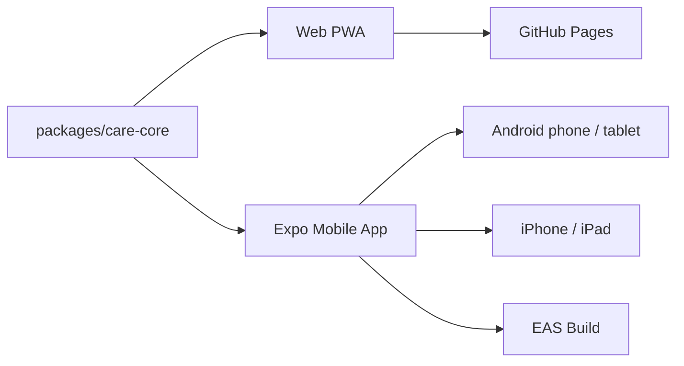
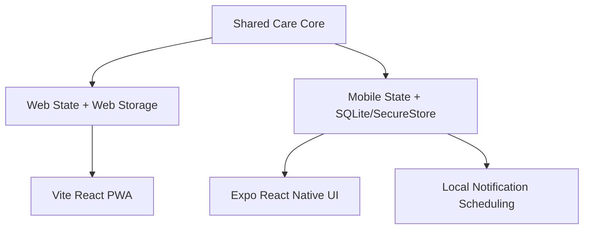

# CareGuardian AI

A `web + mobile` care continuity platform that turns caregiver knowledge into a reusable operating manual. The web app stays as the fast demo and backup surface, while the mobile app is now the real delivery target for phones and tablets.  
[한국어](./README.md)



## Snapshot

| Item | Status | Notes |
|---|---|---|
| Shared care core | Done | `packages/care-core` now owns manual, schedule, reminder, and relay logic |
| Web PWA | Done | Existing Pages demo and backup path remain intact |
| Expo mobile app | Done | `apps/mobile` targets Android, iPhone, and iPad |
| Android emulator verification | Done | Render confirmed on `Medium_Phone_API_36.1` |
| iOS delivery prep | Done | `apps/mobile/eas.json` added for EAS cloud builds |
| Voice output | Done | Web Speech on web, `expo-speech` on mobile |
| Medication notification prep | Done | Local scheduling logic added in mobile app |

## Architecture



## Workspace

| Path | Responsibility | Notes |
|---|---|---|
| `src` | Existing web PWA | GitHub Pages demo remains live |
| `apps/mobile` | Expo app | Android, iPhone, and iPad target |
| `packages/care-core` | Shared domain | Imported by both web and mobile |
| `docs/mobile-delivery.md` | Delivery guide | Android + iOS setup and build notes |
| `CLAUDE.md` | Claude Code handoff | Follow-on collaboration entrypoint |

## Run locally

```bash
npm install
npm run dev
npm test -- --run
npm run build
npm run mobile:typecheck
```

## Run on Android

```powershell
$env:ANDROID_HOME="$env:LOCALAPPDATA\Android\Sdk"
$env:JAVA_HOME="C:\Program Files\Android\Android Studio\jbr"
$env:Path="$env:ANDROID_HOME\platform-tools;$env:ANDROID_HOME\emulator;$env:JAVA_HOME\bin;$env:Path"
npm run mobile:android:go
```

Korean: 위 명령은 Expo Go 기준의 빠른 UI 확인용입니다. 복약 알림 같은 네이티브 모듈 검증은 `npm run mobile:android:dev`로 진행합니다.  
English: The command above is the quick Expo Go path. Validate native modules such as medication notifications with `npm run mobile:android:dev`.

## Store build commands

```powershell
npx eas-cli login
npx eas-cli build --platform android --profile preview
npx eas-cli build --platform ios --profile preview
```

Korean: 이 저장소는 이미 `@sinmb79/careguardian-ai-mobile` EAS 프로젝트와 연결돼 있습니다.  
English: This repository is already linked to the `@sinmb79/careguardian-ai-mobile` EAS project.

## Current constraints

1. The iOS simulator cannot run directly on Windows.
2. `expo-notifications` is not fully supported in Expo Go, so dev-client verification is the next step.
3. Mobile persistence currently uses SQLite + SecureStore; a stronger encryption layer is the next hardening step.

## Public links

```text
GitHub Repository: https://github.com/sinmb79/careguardian-ai/
GitHub Pages: https://sinmb79.github.io/careguardian-ai/
```

## Reference docs

1. [Mobile delivery guide](./docs/mobile-delivery.md)
2. [Claude Code handoff](./CLAUDE.md)
3. [Mobile design spec](./docs/superpowers/specs/2026-04-10-mobile-delivery-design.md)
