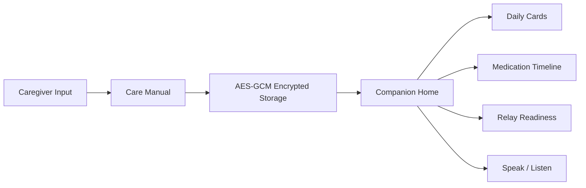
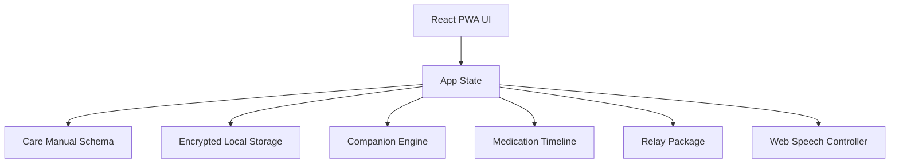

# CareGuardian AI

A local-first PWA that structures and encrypts caregiver knowledge so care continuity can survive handoff, absence, or emergency.  
[한국어](./README.md)



## Snapshot

| Item | Status | Notes |
|---|---|---|
| Manual schema | Done | Structured routines, medication, calming notes, emergency contacts, relay targets |
| Local secure storage | Done | Browser Web Crypto AES-GCM |
| Caregiver editor | Done | Fast input flow for essential care handoff data |
| Companion home | Done | Daily cards, medication timeline, relay readiness, manual-aware replies |
| Voice support | Done | Web Speech API speak and listen hooks |
| Encrypted backup | Done | Export and import backup JSON files |
| GitHub Pages deploy | Ready | Auto deploy on push to `main` |

## Architecture



## Run locally

```bash
npm install
npm run dev
```

```bash
npm test -- --run
npm run build
```

## Next steps

1. Connect real on-device Gemma inference
2. Add Android-native speech I/O and background notifications
3. Move storage to IndexedDB or SQLite
4. Connect n8n relay automation and guardian invite flows
5. Integrate ESP32 / Raspberry Pi home hub devices

## Public links

```text
GitHub Repository: https://github.com/sinmb79/careguardian-ai
GitHub Pages: https://sinmb79.github.io/careguardian-ai/
```
