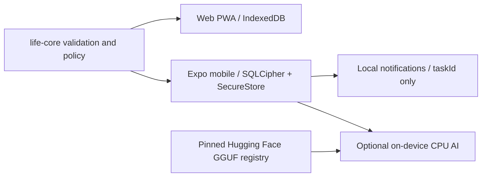

# Life Steward AI

[한국어](./README.md)

Life Steward AI is a general personal-productivity, local-first tool for organizing schedules, notes, checklists, and user-created personal features on one device.


```mermaid
flowchart LR
  Core["life-core validation and policy"] --> Web["Web PWA / IndexedDB"]
  Core --> Mobile["Expo mobile / SQLCipher + SecureStore"]
  Mobile --> Notify["Local notifications / taskId only"]
  Mobile --> AI["Optional on-device CPU AI"]
  Registry["Pinned Hugging Face GGUF registry"] --> AI
```

## What it does

- The web PWA stores its workspace only in browser IndexedDB.
- The mobile app uses SQLCipher, SecureStore/Android Keystore separation, device authentication, background locking, and screen-capture blocking.
- The displayed notification title is generic and the data payload contains only a task ID; note text is excluded.
- Optional AI runs locally on the device and offers only summarizing, rewriting, title suggestions, and checklist drafts. Results require user approval before saving.
- “Delete all local data” stops active inference, cancels local notifications, removes models and partial files, deletes the workspace and keys, then resets memory.

## Privacy boundary

There are no accounts, ads, analytics, remote push, or contact, location, microphone, camera, or external-storage permissions. Choosing a model install makes a request for a pinned GGUF file from Hugging Face; the host may see the device IP address and ordinary network metadata. Prompts and outputs are not sent with that request.

Data safety values are not final until the Task 10 production-AAB and real-device network observation are complete. Closed testing uses only synthetic, non-sensitive schedules and notes.

## Delivery target

- Display name: `생활후견 AI` / `Life Steward AI`
- Android: `1.1.0` (`versionCode 7`)
- Preserved identifiers: package `com.sinmb.careguardianai`, EAS slug `careguardian-ai-mobile`, EAS project ID `15b9e293-b631-4b77-8cfc-9937cd604dd4`
- Planned Play positioning: Productivity, target age 18+, limited-scope local document helper; IARC content rating is confirmed after its questionnaire.

```powershell
npm ci
npm test -- --run
npm run build
npm run mobile:typecheck
```

See the [Korean delivery guide](./docs/mobile-delivery.md), [closed-test operations](./docs/private-test-operations.md), [readiness record](./docs/security/private-test-readiness-2026-07-30.md), and [store listing](./docs/store-listing.md).
