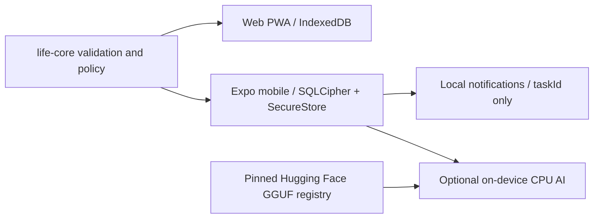

# Life Steward AI

[한국어](./README.md)

Life Steward AI is a general personal-productivity, local-first tool for organizing schedules, notes, checklists, and user-created personal features on one device.


```mermaid
flowchart LR
  Core["life-core validation and policy"] --> Web["Web PWA / IndexedDB"]
  Core --> Mobile["Expo mobile / SQLCipher + SecureStore"]
  Mobile --> Notify["Local notifications / taskId only"]
  Mobile --> AI["Optional on-device CPU AI"]
  Registry["Pinned Hugging Face GGUF registry"] --> AI
```

## What it does

- The web PWA stores its workspace only in browser IndexedDB.
- The mobile app uses SQLCipher, SecureStore/Android Keystore separation, device authentication, background locking, and screen-capture blocking.
- The displayed notification title is generic and the data payload contains only a task ID; note text is excluded.
- Optional AI runs locally on the device and offers only summarizing, rewriting, title suggestions, and checklist drafts. Results require user approval before saving.
- “Delete all local data” stops active inference, cancels local notifications, removes models and partial files, deletes the workspace and keys, then resets memory.

## Privacy boundary

There are no accounts, ads, analytics, remote push, or contact, location, microphone, camera, or external-storage permissions. Choosing a model install makes a request for a pinned GGUF file from Hugging Face; the host may see the device IP address and ordinary network metadata. Prompts and outputs are not sent with that request.

The privacy policy distinguishes Hugging Face’s possible external installation-request records from on-device deletion. Closed testing uses only synthetic, non-sensitive schedules and notes.

## Validation stages

- **Start synthetic closed-test submission and operation:** require the final AAB for the current version, static AAB inspection, Android-native screenshots, and reconciliation of the Play Console listing, declarations, and Data safety entries. Samsung/Pixel physical-device evidence is not an absolute prerequisite for this stage.
- **Collect during the closed test:** use synthetic data on Samsung and Pixel devices to record lock, PIN fallback, deletion, local-notification, model-installation, and network evidence.
- **Real personal/sensitive data or general release:** remains NO-GO until the physical-device evidence and remaining release checks are complete.

## Delivery target

- Display name: `생활후견 AI` / `Life Steward AI`
- Android: `1.1.1` (`versionCode 8`)
- Preserved identifiers: package `com.sinmb.careguardianai`, EAS slug `careguardian-ai-mobile`, EAS project ID `15b9e293-b631-4b77-8cfc-9937cd604dd4`
- Play Alpha `1.1.0 (7)` has been available to testers since 2026-07-31. As of 2026-08-09, 12 testers have opted in and the test is on day 8. The `1.1.1 (8)` candidate fixes a lock screen that could remain stuck after successful device authentication on app relaunch.

```powershell
npm ci
npm test -- --run
npm run build
npm run mobile:typecheck
```

See the [Korean delivery guide](./docs/mobile-delivery.md), [closed-test operations](./docs/private-test-operations.md), [readiness record](./docs/security/private-test-readiness-2026-07-30.md), [store listing](./docs/store-listing.md), [Android AAB evidence](./docs/security/android-aab-evidence-2026-07-31.md), and [Play submission evidence](./docs/security/google-play-closed-test-submission-2026-07-31.md).
