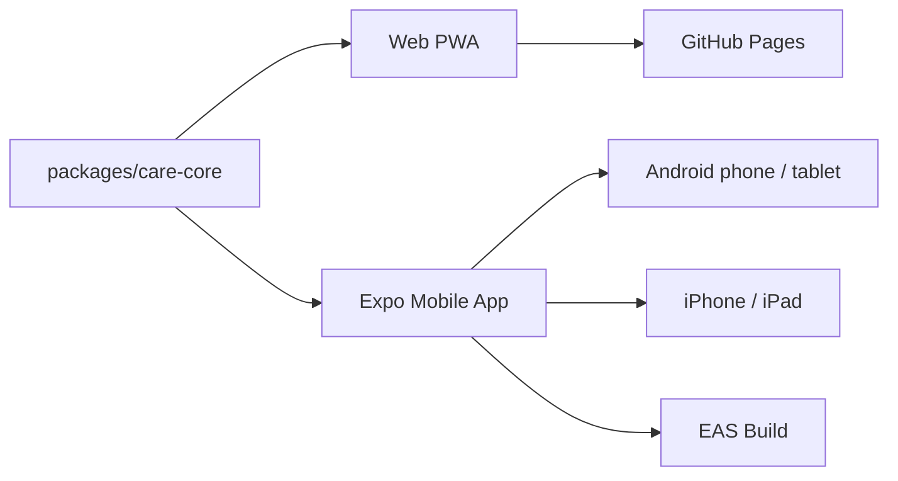
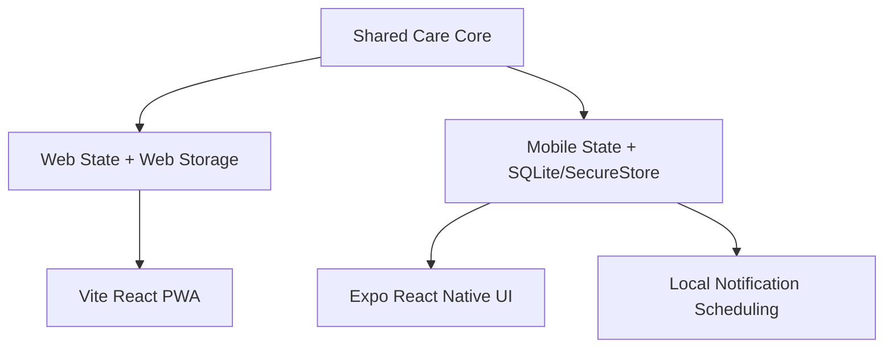

# 돌봄후견 AI

보호자가 남긴 생활 지식을 구조화하고 이어받을 수 있게 만드는 `웹 + 모바일` 돌봄 연속성 플랫폼입니다. 웹은 빠른 데모와 백업 경로를 맡고, 모바일은 실제 배포와 현장 사용을 맡습니다.  
[English](./README.en.md)



## 한눈에 보기

| 항목 | 현재 상태 | 설명 |
|---|---|---|
| 공용 돌봄 코어 | 완료 | `packages/care-core`에 매뉴얼, 일정, 복약, 릴레이 로직 공유화 |
| 웹 PWA | 완료 | GitHub Pages 데모와 백업/암호화 경로 유지 |
| Expo 모바일 앱 | 완료 | `apps/mobile`에서 Android/iPhone/iPad 대상 앱 골격 확보 |
| Android 에뮬레이터 검증 | 완료 | `Medium_Phone_API_36.1`에서 앱 렌더링 확인 |
| iOS 배포 준비 | 완료 | `apps/mobile/eas.json` 추가, Windows 기준 EAS 경로 정리 |
| 음성 출력 | 완료 | 웹은 Web Speech, 모바일은 `expo-speech` |
| 복약 알림 준비 | 완료 | 모바일 `expo-notifications` 스케줄 로직 추가 |

## 시스템 구조



## 작업 공간

| 경로 | 역할 | 비고 |
|---|---|---|
| `src` | 기존 웹 PWA | Pages 데모 유지 |
| `apps/mobile` | Expo 앱 | Android, iPhone, iPad 대상 |
| `packages/care-core` | 공용 도메인 | 웹/모바일 공유 |
| `docs/mobile-delivery.md` | 배포 준비 문서 | Android/iOS 실행 경로 |
| `CLAUDE.md` | Claude Code 인계 문서 | 후속 협업용 |

## 빠른 실행

```bash
npm install
npm run dev
```

```bash
npm test -- --run
npm run build
npm run mobile:typecheck
```

## Android 실행

```powershell
$env:ANDROID_HOME="$env:LOCALAPPDATA\Android\Sdk"
$env:JAVA_HOME="C:\Program Files\Android\Android Studio\jbr"
$env:Path="$env:ANDROID_HOME\platform-tools;$env:ANDROID_HOME\emulator;$env:JAVA_HOME\bin;$env:Path"
npm run mobile:android
```

## 실제 배포 명령

```powershell
npx eas-cli login
npx eas-cli build --platform android --profile preview
npx eas-cli build --platform ios --profile preview
```

## 공개 링크

```text
GitHub Repository: https://github.com/sinmb79/careguardian-ai/
GitHub Pages: https://sinmb79.github.io/careguardian-ai/
```

## 현재 제약

1. Windows에서는 iOS 시뮬레이터를 직접 돌릴 수 없습니다.
2. Expo Go에서는 `expo-notifications`가 완전하지 않아 dev client 검증이 다음 단계입니다.
3. 모바일 저장은 현재 SQLite + SecureStore 중심이며, AES 계층은 다음 단계에서 보강합니다.

## 참고 문서

1. [모바일 배포 준비 문서](./docs/mobile-delivery.md)
2. [Claude Code 인계 문서](./CLAUDE.md)
3. [모바일 설계 문서](./docs/superpowers/specs/2026-04-10-mobile-delivery-design.md)
