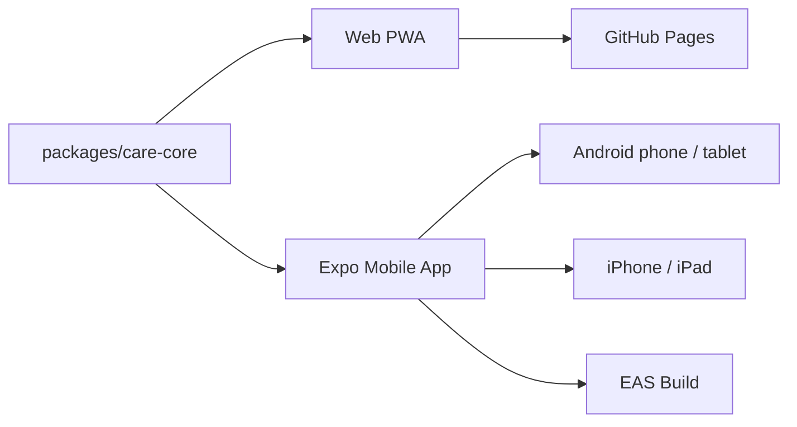
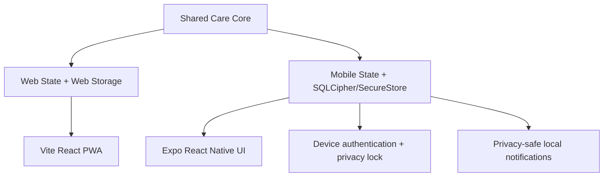

# 돌봄후견 AI

보호자가 남긴 생활 지식을 구조화하고 이어받을 수 있게 만드는 `웹 + 모바일` 돌봄 연속성 플랫폼입니다. 웹은 빠른 데모와 백업 경로를 맡고, 모바일은 실제 배포와 현장 사용을 맡습니다.  
[English](./README.en.md)



## 한눈에 보기

| 항목 | 현재 상태 | 설명 |
|---|---|---|
| 공용 돌봄 코어 | 완료 | `packages/care-core`에 매뉴얼, 일정, 복약, 릴레이 로직 공유화 |
| 웹 PWA | 완료 | GitHub Pages 데모와 백업/암호화 경로 유지 |
| Expo 모바일 앱 | 비공개 테스트 후보 | Android `1.0.1`, production AAB와 Play 비공개 테스트 준비 |
| Android 에뮬레이터 검증 | 완료 | 릴리스 APK 기동과 주요 화면 렌더링 확인 |
| iOS 배포 준비 | 완료 | `apps/mobile/eas.json` 추가, Windows 기준 EAS 경로 정리 |
| 로컬 암호화·잠금 | 완료 | SQLCipher + SecureStore 키 분리, 기기 인증, 백그라운드 잠금, 화면 캡처 차단 |
| 복약 알림 준비 | 완료 | 민감정보 없는 매일 로컬 알림, 예약·취소 결과 재확인 |

## 시스템 구조



## 작업 공간

| 경로 | 역할 | 비고 |
|---|---|---|
| `src` | 기존 웹 PWA | Pages 데모 유지 |
| `apps/mobile` | Expo 앱 | Android, iPhone, iPad 대상 |
| `packages/care-core` | 공용 도메인 | 웹/모바일 공유 |
| `docs/mobile-delivery.md` | 배포 준비 문서 | Android/iOS 실행 경로 |
| `CLAUDE.md` | Claude Code 인계 문서 | 후속 협업용 |

## 빠른 실행

```bash
npm install
npm run dev
```

```bash
npm test -- --run
npm run build
npm run mobile:typecheck
```

## Android 실행

```powershell
$env:ANDROID_HOME="$env:LOCALAPPDATA\Android\Sdk"
$env:JAVA_HOME="C:\Program Files\Android\Android Studio\jbr"
$env:Path="$env:ANDROID_HOME\platform-tools;$env:ANDROID_HOME\emulator;$env:JAVA_HOME\bin;$env:Path"
npm run mobile:android:go
```

한국어: 위 명령은 Expo Go 기준의 빠른 UI 확인용입니다. 복약 알림 같은 네이티브 모듈 검증은 `npm run mobile:android:dev`로 진행합니다.  
English: The command above is the quick Expo Go path. Validate native modules such as medication notifications with `npm run mobile:android:dev`.

## 실제 배포 명령

```powershell
npx eas-cli login
npx eas-cli build --platform android --profile production
npx eas-cli build --platform ios --profile preview
```

한국어: 이 저장소는 이미 `@sinmb79/careguardian-ai-mobile` EAS 프로젝트와 연결돼 있습니다.  
English: This repository is already linked to the `@sinmb79/careguardian-ai-mobile` EAS project.

## 공개 링크

```text
GitHub Repository: https://github.com/sinmb79/careguardian-ai/
GitHub Pages: https://sinmb79.github.io/careguardian-ai/
```

## 현재 제약

1. 현재 비공개 테스트는 가상의 인물·약·연락처만 허용합니다. 실제 건강·복약정보 테스트는 실기기 포렌식·네트워크·알림 매트릭스 검증 뒤에 별도로 판단합니다.
2. Expo Go는 네이티브 보안·알림 검증 대상이 아닙니다. Play 후보는 EAS production AAB로만 만듭니다.
3. Windows에서는 iOS 시뮬레이터를 직접 돌릴 수 없습니다.

## 참고 문서

1. [모바일 배포 준비 문서](./docs/mobile-delivery.md)
2. [비공개 테스트 운영 가이드](./docs/private-test-operations.md)
3. [보안·안전 준비도 감사](./docs/security/private-test-readiness-2026-07-20.md)
4. [Claude Code 인계 문서](./CLAUDE.md)
5. [모바일 설계 문서](./docs/superpowers/specs/2026-04-10-mobile-delivery-design.md)
