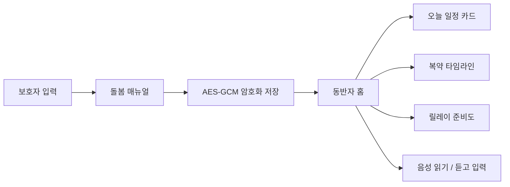
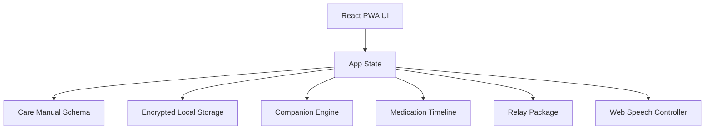

# 돌봄후견 AI

보호자가 남긴 생활 지식을 구조화하고 암호화해, 돌봄이 끊기지 않도록 돕는 로컬 우선 PWA입니다.  
[English](./README.en.md)



## 한눈에 보기

| 항목 | 현재 상태 | 설명 |
|---|---|---|
| 매뉴얼 스키마 | 완료 | 이름, 루틴, 복약, 안정화, 긴급연락처, 릴레이 대상 구조화 |
| 로컬 보안 저장 | 완료 | Web Crypto AES-GCM 기반 암호화 저장 |
| 보호자 편집 화면 | 완료 | 필수 돌봄 정보를 빠르게 입력하고 수정 가능 |
| 동반자 홈 | 완료 | 일정 카드, 복약 타임라인, 릴레이 준비도, 말벗 응답 |
| 음성 보조 | 완료 | Web Speech API 기반 음성 읽기, 듣고 입력 |
| 암호화 백업 | 완료 | 백업 파일 저장 및 다시 불러오기 |
| GitHub Pages 배포 | 설정 완료 | `main` 푸시 시 자동 공개배포 |

## 시스템 구조



## 주요 화면

| 화면 | 목적 | 핵심 기능 |
|---|---|---|
| 보호자 모드 | 초기 매뉴얼 작성 | 이름, 아침 루틴, 긴급 연락처, 복약 시각, 안정화 메모, 릴레이 대상 |
| 동반자 모드 | 당사자용 일상 동반 | 오늘 일정 카드, 복약 예정/지남 상태, 말벗 응답 |
| 릴레이 준비도 | 인수인계 준비 상태 점검 | 점수, 핵심 행동 요약, 패키지 JSON 저장 |

## 빠른 실행

```bash
npm install
npm run dev
```

```bash
npm test -- --run
npm run build
```

## 공개 배포

```text
GitHub Repository: https://github.com/sinmb79/careguardian-ai
GitHub Pages: https://sinmb79.github.io/careguardian-ai/
```

## 남은 개발

1. Gemma 온디바이스 추론 엔진 연결
2. Android 실기기 STT/TTS 및 백그라운드 알림 연동
3. IndexedDB 또는 SQLite 기반 저장소 확장
4. n8n 릴레이 체인, 후견인 초대 링크, 실제 알림 연동
5. ESP32/Raspberry Pi 홈 허브 연동
