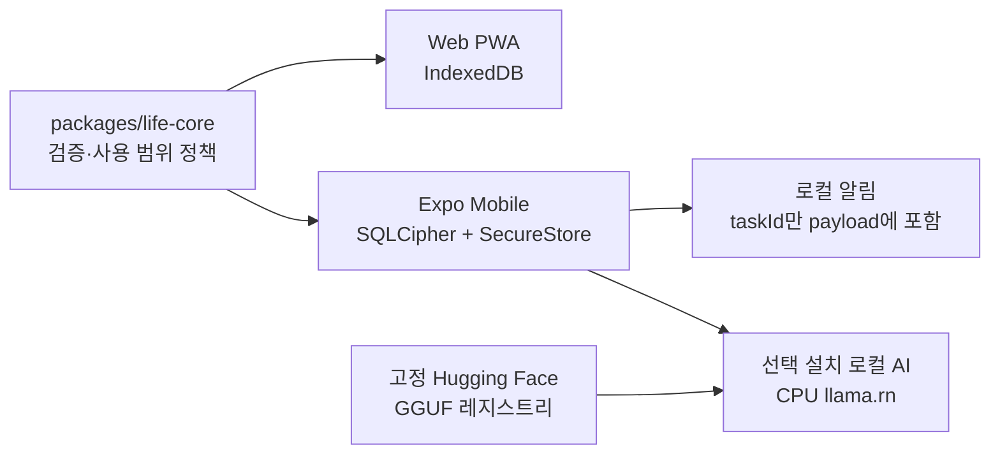

# 생활후견 AI

[English](./README.en.md)

생활후견 AI는 일정, 메모, 체크리스트와 사용자가 만든 개인 기능을 한 기기에서 정리하는 일반 개인 생산성·로컬 우선 도구입니다. 계정이나 광고·분석 서비스를 만들지 않으며, 웹은 브라우저의 IndexedDB에, 모바일은 SQLCipher와 SecureStore/Android Keystore 경계에 데이터를 둡니다.


```mermaid
flowchart LR
  Core["packages/life-core\n검증·사용 범위 정책"] --> Web["Web PWA\nIndexedDB"]
  Core --> Mobile["Expo Mobile\nSQLCipher + SecureStore"]
  Mobile --> Notify["로컬 알림\ntaskId만 payload에 포함"]
  Mobile --> AI["선택 설치 로컬 AI\nCPU llama.rn"]
  Registry["고정 Hugging Face\nGGUF 레지스트리"] --> AI
```

## 현재 범위

| 항목 | 실제 동작 |
|---|---|
| 웹 PWA | 개인 작업공간을 브라우저 IndexedDB에만 저장합니다. |
| 모바일 | 기기 인증, 화면 캡처 차단, 백그라운드 잠금, SQLCipher 저장을 제공합니다. |
| 일반 알림 | Android 자체 로컬 모듈로만 예약합니다. 표시 제목은 일반 문구이며 data payload에는 `taskId`만 둡니다. 제목·메모 본문은 저장하거나 payload에 넣지 않습니다. |
| 로컬 AI | 사용자가 고정된 GGUF 파일 설치에 동의한 경우에만 기기 CPU에서 요약·문장 다듬기·제목 제안·체크리스트 초안을 수행합니다. 결과는 자동 저장되지 않습니다. |
| 전체 삭제 | 실행 중인 로컬 AI 중지, 일반 알림 취소, 모델·부분 파일·작업공간·키·메모리 초기화를 순서대로 시도합니다. |

## 개인정보와 네트워크 경계

- 계정, 광고, 분석 SDK, 원격 푸시, 연락처·위치·마이크·카메라·외부 저장소 권한을 사용하지 않습니다.
- 로컬 AI 설치를 선택하면 고정된 Hugging Face GGUF 파일을 요청합니다. 이 요청에서 사용자의 IP 주소와 일반 네트워크 메타데이터는 호스트에 보일 수 있습니다. 프롬프트와 생성 결과는 이 요청으로 전송하지 않습니다.
- 선택형 모델 다운로드에 따른 Hugging Face 외부 기록과 기기 내 전체 삭제의 차이는 [개인정보처리방침](./public/privacy-policy.html)에 명확히 고지합니다.
- 비공개 테스트에서는 합성·비민감 생활 일정과 메모만 사용하세요. 실제 개인정보나 민감정보를 입력하지 마세요.

## 검증 단계

- **합성 데이터 비공개 테스트 제출·운영 시작:** 현재 버전의 최종 AAB, AAB 정적 검사, Android-native 스크린샷, Play Console 문안·선언·Data safety 대조가 모두 완료되어야 합니다. Samsung/Pixel 물리 기기 증거는 이 단계의 절대 선행 조건이 아닙니다.
- **비공개 테스트 중 수집:** Samsung/Pixel에서 잠금·PIN fallback·삭제·로컬 알림·모델 설치·네트워크를 합성 데이터로 확인하고 증거를 남깁니다.
- **실제 개인정보·민감정보 단계 또는 정식 출시:** 위 물리 기기 증거와 남은 출시 검증이 완료되기 전까지 `NO-GO`입니다.

## 실행과 검증

```powershell
npm ci
npm test -- --run
npm run build
npm run mobile:typecheck
```

Android의 빠른 UI 확인은 `npm run mobile:android:go`이며, SQLCipher·알림·로컬 AI 같은 네이티브 경계 확인에는 개발 또는 배포 빌드가 필요합니다. 현재 알림은 Android 전용입니다. 출시 후보는 `npm run verify:no-remote-push:artifacts -- --aab <final.aab> --universal-apk <universal.apk>`로 FCM/FID·Cloud Messaging·ShortcutBadger 부재를 확인해야 합니다.

## 배포 상태

- 표시명: `생활후견 AI` / `Life Steward AI`
- Android 대상 버전: `1.1.2` (`versionCode 9`)
- 유지하는 식별자: package `com.sinmb.careguardianai`, EAS slug `careguardian-ai-mobile`, EAS project ID `15b9e293-b631-4b77-8cfc-9937cd604dd4`
- Play Alpha `1.1.0 (7)`은 2026-07-31부터 테스터에게 제공 중이며, 2026-08-09 현재 참여자 12명·운영 8일째입니다. `1.1.1 (8)`은 인증 복귀 후 재백그라운드 경합이 추가로 발견되어 Google 검토 중에 회수했습니다. 이를 차단한 `1.1.2 (9)`을 새 Alpha 후보로 검증합니다.

## 문서

1. [모바일 배포와 재캡처 가이드](./docs/mobile-delivery.md)
2. [비공개 테스트 운영](./docs/private-test-operations.md)
3. [비공개 테스트 준비도](./docs/security/private-test-readiness-2026-07-30.md)
4. [스토어 등록 문안](./docs/store-listing.md)
5. [개인정보처리방침](./public/privacy-policy.html)
6. [회수된 Android 1.1.1 (8) AAB 검증 증거](./docs/security/android-aab-evidence-2026-08-09.md)
7. [회수된 Google Play Alpha 1.1.1 (8) 제출 증거](./docs/security/google-play-closed-test-update-2026-08-09.md)
8. [Android 1.1.0 (7) 최초 AAB 검증 증거](./docs/security/android-aab-evidence-2026-07-31.md)
9. [Google Play 최초 비공개 테스트 제출 증거](./docs/security/google-play-closed-test-submission-2026-07-31.md)
