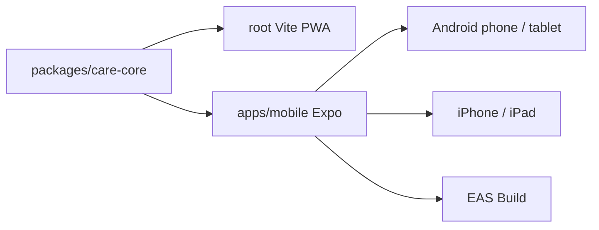

# 모바일 배포 준비 / Mobile Delivery Guide

한국어: 이 문서는 `apps/mobile` Expo 앱을 안드로이드폰, 안드로이드 태블릿, 아이폰, 아이패드로 배포하기 위한 실제 준비 절차를 정리합니다.  
English: This document explains the practical setup path for shipping the `apps/mobile` Expo app to Android phones, Android tablets, iPhone, and iPad.

## 현재 상태 / Current Status

| 항목 | 상태 | 비고 |
|---|---|---|
| 공용 돌봄 로직 | 완료 | `packages/care-core` |
| 웹 데모 | 유지 | GitHub Pages 배포 유지 |
| 모바일 앱 골격 | 완료 | `apps/mobile` Expo app |
| Android 에뮬레이터 실행 | 확인 | `Medium_Phone_API_36.1`에서 Expo Go 로드 확인 |
| iOS 시뮬레이터 | 불가 | Windows에서는 직접 실행 불가, macOS 필요 |
| EAS 프로젝트 연결 | 완료 | `15b9e293-b631-4b77-8cfc-9937cd604dd4` |

## 작업 공간 / Workspace



## 로컬 필수 도구 / Required Local Tools

| 도구 | 이 저장소 기준 상태 | 설명 |
|---|---|---|
| Node.js | 확인 | `v24.14.0` |
| Android Studio | 확인 | `C:\Program Files\Android\Android Studio` |
| Android SDK | 확인 | `%LOCALAPPDATA%\Android\Sdk` |
| Emulator AVD | 확인 | `Medium_Phone_API_36.1` |
| Java | Android Studio JBR 사용 | `C:\Program Files\Android\Android Studio\jbr` |
| Xcode | 없음 | iOS 시뮬레이터는 macOS 필요 |

## Windows 실행 명령 / Windows Commands

한국어: PowerShell에서 아래 환경변수를 먼저 잡으면 모바일 명령이 안정적으로 동작합니다.  
English: In PowerShell, set these environment variables first for reliable mobile commands.

```powershell
$env:ANDROID_HOME="$env:LOCALAPPDATA\Android\Sdk"
$env:JAVA_HOME="C:\Program Files\Android\Android Studio\jbr"
$env:Path="$env:ANDROID_HOME\platform-tools;$env:ANDROID_HOME\emulator;$env:JAVA_HOME\bin;$env:Path"
```

```powershell
npm install
npm run mobile:typecheck
npm run mobile:android:go
```

## 개발 빌드 / Development Build

한국어: `expo-notifications`는 Expo Go에서 제약이 있으므로, 복약 알림을 실제로 검증하려면 dev client 빌드가 맞습니다.  
English: `expo-notifications` is limited in Expo Go, so a dev client build is the correct path for real medication notification verification.

```powershell
npm --workspace apps/mobile run android:dev
```

한국어: `mobile:android:go`는 빠른 UI 확인용이고, `mobile:android:dev`는 네이티브 모듈 검증용입니다.  
English: `mobile:android:go` is the quick UI verification path, while `mobile:android:dev` is the native-module verification path.

## iOS 경로 / iOS Path

한국어: Windows에서는 iOS 시뮬레이터를 직접 돌릴 수 없습니다. 대신 EAS Cloud Build로 `.ipa`를 만들고, TestFlight 또는 원격 Mac에서 검증합니다.  
English: You cannot run the iOS simulator directly on Windows. Instead, build an `.ipa` using EAS Cloud Build and validate it through TestFlight or a remote Mac.

```powershell
npx eas-cli login
npx eas-cli build --platform ios --profile preview
npx eas-cli build --platform android --profile preview
```

한국어: 이 저장소는 이미 `@sinmb79/careguardian-ai-mobile` EAS 프로젝트에 연결되어 있습니다.  
English: This repository is already linked to the `@sinmb79/careguardian-ai-mobile` EAS project.

## 현재 확인된 제한 / Known Limits

| 항목 | 설명 |
|---|---|
| Expo Go 알림 | 원격 푸시 기능은 제거되어 경고가 표시됨 |
| 음성 듣기 입력 | 아직 네이티브 STT 플러그인 미선정 |
| 로컬 암호화 | 모바일은 현재 SQLite + SecureStore 중심, AES 계층은 다음 단계 |

## Claude Code 인계 포인트 / Claude Code Handoff

한국어: Claude Code가 이어받을 때는 `README.md`, `docs/mobile-delivery.md`, `docs/superpowers/specs/2026-04-10-mobile-delivery-design.md`를 먼저 읽고 시작하면 됩니다.  
English: If Claude Code takes over, start by reading `README.md`, `docs/mobile-delivery.md`, and `docs/superpowers/specs/2026-04-10-mobile-delivery-design.md`.
