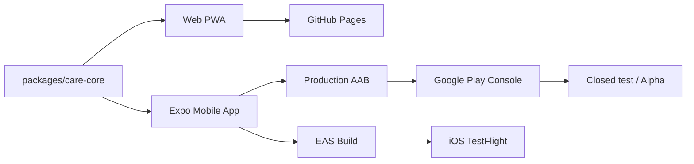

# Mobile Delivery Guide

This document covers the delivery pipeline for the `apps/mobile` Expo app to Android phones, Android tablets, iPhone, and iPad.

## Current Status (2026-07-20)

| Item | Status | Notes |
|---|---|---|
| Shared care core | Done | `packages/care-core` |
| Web demo | Maintained | GitHub Pages deployment |
| Mobile app | Closed-test candidate | `1.0.1`, Android `versionCode 6` |
| UX accessibility overhaul | Done | 15 files, larger fonts, emoji icons, emotion check-in |
| Tablet 2-column layout | Done | Web (Tailwind sm:grid-cols-2) + Mobile (flexWrap) |
| App icons | Done | Generated from SVG (1024, 512, adaptive) |
| Android emulator | Verified | Production-release APK launch and primary UI render |
| iOS simulator | N/A | Windows cannot run iOS simulator, use EAS |
| EAS project | Connected | `@sinmb79/careguardian-ai-mobile` |
| Production AAB | Built and verified | `apps/mobile/careguardian-ai-private-test-v1.0.1-vc6.aab`, build `c4968750-6d8a-41a9-ab50-b4a55661623e` |
| Play Console | Under Google review | `1.0.1 (6)` and 12 related changes submitted together as 13 changes on 2026-07-20 |
| Privacy policy | Deployed and verified | `https://sinmb79.github.io/careguardian-ai/privacy-policy.html` returned HTTP 200 on 2026-07-20 |
| Store screenshots | Captured | 4 phone + 2 tablet 7" + 2 tablet 10" + feature graphic |
| Security gate | Synthetic-data only | SQLCipher, device authentication, privacy-safe local notifications, deletion and screen-capture controls implemented |

## Workspace



## Required Local Tools

| Tool | Status | Path |
|---|---|---|
| Node.js | v24.14.0 | system |
| Android Studio | Installed | `C:\Program Files\Android\Android Studio` |
| Android SDK | Installed | `%LOCALAPPDATA%\Android\Sdk` |
| Emulator AVD | Ready | `Medium_Phone_API_36.1` |
| Java | Android Studio JBR | `C:\Program Files\Android\Android Studio\jbr` |
| Xcode | N/A | iOS simulator requires macOS |

## Windows Commands

Set environment variables in PowerShell first:

```powershell
$env:ANDROID_HOME="$env:LOCALAPPDATA\Android\Sdk"
$env:JAVA_HOME="C:\Program Files\Android\Android Studio\jbr"
$env:Path="$env:ANDROID_HOME\platform-tools;$env:ANDROID_HOME\emulator;$env:JAVA_HOME\bin;$env:Path"
```

Quick UI check (Expo Go):
```powershell
npm run mobile:android:go
```

Native module verification (local native build):
```powershell
npm run mobile:android:dev
```

## Build and Submit

### Android Production Build
```powershell
cd apps/mobile
npx eas-cli build --platform android --profile production --non-interactive
```

### iOS Preview Build
```powershell
npx eas-cli build --platform ios --profile preview
```

### Download AAB

The AAB is intentionally ignored by Git. The verified local candidate is `apps/mobile/careguardian-ai-private-test-v1.0.1-vc6.aab`.

- Size: `63,532,732` bytes
- SHA-256: `2E67A5011192EF22D3F3E4B406BCE5A6C685AAB2641F152006C960842D649AF0`
- EAS build: `https://expo.dev/accounts/sinmb79/projects/careguardian-ai-mobile/builds/c4968750-6d8a-41a9-ab50-b4a55661623e`
- EAS artifact: `https://expo.dev/artifacts/eas/2tYRdcdMuYu5e4CmUMtRgm28prS6yOt7YF-ORcDrehQ.aab`

## Play Store Assets

All in `docs/screenshots/`:

| File | Size | Purpose |
|---|---|---|
| `feature-graphic.png` | 1024x500 | Play Store banner |
| `icon-512.png` | 512x512 | High-res icon |
| `phone-screenshot-{1-4}.png` | 1081x2402 | Phone screenshots |
| `tablet7-screenshot-{1-2}.png` | 900x1536 | 7-inch tablet screenshots |
| `tablet10-screenshot-{1,1-companion}.png` | 1600x2560 | 10-inch tablet screenshots (2-column layout) |

Recapture with: `node scripts/capture-screenshots.mjs` (requires `npm run build` first, then `npx vite preview --port 4173`)

## Play Console Status

Google Play Console: developer account **22B**, app **CareGuardian AI**

Observed in the console on 2026-07-20:

- Internal test: legacy `versionCode 2` active. It is retired and must not be promoted.
- Closed test `Alpha`: `1.0.1 (versionCode 6)` AAB uploaded and release saved. It was submitted for Google review with the other pending changes on 2026-07-20.
- Play recognized minSdk 24+, targetSdk 36 and four ABIs. The only release warning is the optional R8/ProGuard deobfuscation mapping recommendation; code shrinking is not enabled in this project.
- Data safety: no collection / no sharing, with the deployed privacy-policy URL. Continue real-device network observation during testing.
- Health declaration: **Medication and Treatment Management** saved.
- Category: **Medical** saved.
- Advertising ID declaration: **not used** saved, consistent with the final manifest having no `AD_ID` permission.
- Publishing overview shows 13 changes under review, including the Alpha release, Korean store listing, Data safety, Health, privacy policy and Medical category.
- Korea is targeted. Selected tester lists are `22B` (1), `젤리테스터` (44) and `테스터` (8), so listed capacity is up to 53. Duplicate accounts and users who have not opted in do not count as active testers.
- Managed publishing is off. After Google approval, the release may automatically become available to the selected tester lists.
- Closed-test production access requires at least 12 opted-in testers for 14 consecutive days; follow `docs/private-test-operations.md`.

## Known Limits

| Item | Description |
|---|---|
| Expo Go | UI preview only; never use it as security or notification evidence |
| Voice | Mobile input/output disabled for this closed test; web SpeechRecognition input disabled by default |
| Mobile encryption | SQLCipher and SecureStore/Keystore key separation compiled and statically verified; real-device forensic validation remains |
| Network | Limited Android 15 emulator observation showed 0-byte app UID traffic; Samsung/Pixel real-device observation remains required before a categorical no-transmission claim |
| iOS validation | Requires EAS cloud build + TestFlight |

## Closed-test policy and safety gate (2026-07-20)

- Use synthetic people, medicines, and contacts only until real-device forensic, deletion, notification-matrix and runtime-network behavior are verified.
- The mobile CareManual uses an app-specific SQLCipher database with a random 256-bit key stored separately through SecureStore/Android Keystore. Stored profiles require device authentication, background transitions relock the UI, and screen capture is blocked.
- Local daily notification scheduling is not medication adherence confirmation. Notifications may be delayed or missed because of permission, battery, OS/vendor policy, or device state.
- The app no longer invents a dose, time, administration method, care instruction, or family relationship when a user enters only a name.
- The app is not a medical device and does not diagnose, treat, prescribe, validate medication, confirm a dose was taken, or place emergency calls.
- Expo and FCM/Firebase components may be present. Do not make a no-network, no-analytics, or no-data-transmission claim until dynamic runtime verification has completed.
- Web SpeechRecognition input is disabled by default. The web PWA has a fixed demo passphrase in localStorage; no real personal data may be entered. Relay exports can be plaintext.
- The Korean-first/English policy is deployed at the URL above and returned HTTP 200 on 2026-07-20. Tester access and Google review submission were explicitly approved and completed. Before treating the 14-day requirement as started, verify that at least 12 unique testers have actually opted in, and keep the contact email `sinmb79@naver.com`.

## Handoff

When resuming work, read:
1. `README.md` — current state and verified commands
2. `docs/private-test-operations.md` — tester scope, 14-day plan and stop criteria
3. `docs/security/private-test-readiness-2026-07-20.md` — security and safety audit
4. `docs/store-listing.md` — Play Store text and declaration basis
5. `CLAUDE.md` — historical handoff summary
