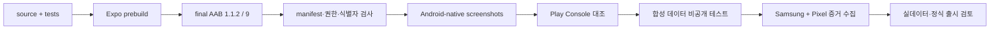

# 생활후견 AI 모바일 배포 가이드

이 문서는 `apps/mobile` Expo 앱의 현재 비공개 테스트 준비 범위와 Android·iOS 빌드 경로를 설명합니다. 과거 제품 자료는 현재 제출 근거가 아니며 이 문서에서 인용하지 않습니다.

## 현재 대상

| 항목 | 값 |
|---|---|
| 표시명 | `생활후견 AI` / `Life Steward AI` |
| Android 버전 | `1.1.2` / `versionCode 9` |
| package | `com.sinmb.careguardianai` (기존 식별자 유지) |
| EAS slug / project ID | `careguardian-ai-mobile` / `15b9e293-b631-4b77-8cfc-9937cd604dd4` |
| Play 위치 | Productivity, 타깃 연령 18세 이상, 기능 제한형 로컬 문서 정리 도구 (IARC 콘텐츠 등급은 설문 후 확정) |
| 테스트 데이터 | 합성·비민감 생활 일정과 메모만 허용 |


```mermaid
flowchart LR
  Source["source + tests"] --> Prebuild["Expo prebuild"]
  Prebuild --> AAB["final AAB 1.1.2 / 9"]
  AAB --> Static["manifest·권한·식별자 검사"]
  Static --> Assets["Android-native screenshots"]
  Assets --> Console["Play Console 대조"]
  Console --> Closed["합성 데이터 비공개 테스트"]
  Closed --> Device["Samsung + Pixel 증거 수집"]
  Device --> Release["실데이터·정식 출시 검토"]
```

## 구현된 경계

- 개인 작업공간은 SQLCipher에 저장하고, 키는 SecureStore/Android Keystore 경계에 둡니다.
- 기기 인증, 백그라운드 잠금, 화면 캡처 차단, Android 백업 비활성화를 사용합니다.
- Android 로컬 알림은 자체 Expo 네이티브 모듈이 `AlarmManager.setAndAllowWhileIdle()`로 기기 안에서만 예약합니다. 알림 제목은 `생활 일정 알림`으로 고정하고, 일정 제목·메모는 저장하거나 전달하지 않으며 알림 extras에는 검증된 `taskId`만 둡니다.
- 이 Android 후보에는 `expo-notifications`, Firebase Messaging/Installations, Google Cloud Messaging/DataTransport, ShortcutBadger, 광고 식별자 라이브러리를 포함하지 않습니다. 이 주장은 최종 AAB와 그 AAB에서 만든 universal APK의 정적 검사가 모두 통과한 경우에만 확정합니다.
- 계정, 광고, 분석 SDK, 원격 푸시, 연락처·위치·마이크·카메라·외부 저장소 권한을 사용하지 않습니다.
- 로컬 AI는 고정 Hugging Face GGUF 파일을 사용자가 선택 설치한 뒤 기기 CPU에서 실행합니다. 설치 요청에서는 IP 주소와 일반 네트워크 메타데이터가 호스트에 보일 수 있으며, 프롬프트와 출력은 전송하지 않습니다.
- 전체 삭제는 실행 중인 추론 중지, 일반 알림 취소, 모델·부분 파일, SQLCipher 작업공간, SecureStore 키, 메모리 초기화를 순서대로 수행합니다.

## 로컬 도구와 명령

```powershell
$env:ANDROID_HOME="$env:LOCALAPPDATA\Android\Sdk"
$env:JAVA_HOME="C:\Program Files\Android\Android Studio\jbr"
$env:Path="$env:ANDROID_HOME\platform-tools;$env:ANDROID_HOME\emulator;$env:JAVA_HOME\bin;$env:Path"

npm ci
npm test -- --run
npm run build
npm run mobile:typecheck
npm run verify:no-remote-push
npm run release:policy-check
```

`npm run mobile:android:go`는 웹·UI 빠른 확인용입니다. 자체 알림 모듈은 Expo Go에 포함되지 않으므로 SQLCipher, 기기 인증, 일반 알림, 로컬 AI는 개발 빌드(`npm run mobile:android:dev`) 또는 production AAB에서 검증해야 합니다. 현재 자체 알림 구현은 Android 전용이며 iOS 알림은 이 후보에서 제공하지 않습니다. iOS는 향후 별도 Swift 로컬 구현과 EAS/TestFlight 검증을 거친 뒤 지원합니다.

Android 알림은 exact-alarm 특별 권한을 요청하지 않는 비정시 방식입니다. 유효한 미래 날짜의 오전 9시 이후 전달을 요청하지만 절전, DND, OEM 배터리 정책 또는 재부팅 직후 상태에 따라 늦거나 표시되지 않을 수 있습니다. 앱은 알림 도착이나 정시 전달을 보장하지 않습니다.

## production AAB

```powershell
cd apps/mobile
npx eas-cli build --platform android --profile production --non-interactive
```

동일한 final AAB에서 bundletool로 universal APK를 만든 뒤 아래 검사를 실행합니다.

```powershell
npm run verify:no-remote-push:artifacts -- --aab <final.aab> --universal-apk <universal.apk>
```

검사는 package lock과 Android release 의존성 보고서, AAB/APK의 엔트리·manifest·리소스·DEX를 제한된 스트리밍 방식으로 확인합니다. 실제 DEX 패키지는 Android SDK `apkanalyzer`로 검사하며, `expo.modules.notifications`, Firebase, FCM/FID, Google Cloud Messaging/DataTransport, ShortcutBadger, 광고 식별자 namespace가 하나라도 있으면 실패합니다. AAB와 universal APK는 반드시 한 쌍으로 제공해야 하며 둘 중 하나만 검사한 결과는 출시 증거가 아닙니다.

새 final AAB에서는 package, versionName, versionCode, target SDK, 64비트 ABI, `allowBackup=false`, 불필요 권한 부재를 정적으로 확인하고 SHA-256을 기록합니다. `docs/store-listing.md`의 Data safety 입력값과 문안·선언을 이 AAB 및 고정 네트워크 경로 계약과 대조한 뒤 실제 Console에 저장합니다. 이 대조와 Android-native 스크린샷 완료까지가 합성 데이터 비공개 테스트 제출·운영 시작 조건입니다.

Samsung/Pixel 네트워크 관찰은 합성 데이터 비공개 테스트 중 수집합니다. 그 결과가 설치 직전 고지·사용자 시작 다운로드 예외 또는 Console 입력과 다르면 테스트를 중단하고 공유값을 보수적으로 수정합니다. 물리 기기 증거와 발견사항 처리는 실제 개인정보·민감정보 단계와 정식 출시의 필수 조건이지만, 합성 데이터 비공개 테스트 제출 자체의 절대 선행 조건은 아닙니다.

## 스크린샷과 Play 자산

`docs/screenshots/`에는 합성·비민감 생활 데이터만 사용한 Android-native Play 후보 자산을 둡니다. 8개 스크린샷은 해상도, 8-bit opaque RGB, 8MB 미만, 2:1 이하 비율과 금칙어 OCR 보조 검사를 통과했으며 상세 해시와 캡처 경계는 `docs/security/android-aab-evidence-2026-07-31.md`에 기록했습니다.

| 파일 | 크기 | 용도 |
|---|---:|---|
| `feature-graphic.png` | 1024×500 | 무문자 feature graphic |
| `phone-screenshot-{1-4}.png` | 1080×1920 | phone 스크린샷 4장 |
| `tablet7-screenshot-{1-2}.png` | 900×1536 | 7-inch tablet 2장 |
| `tablet10-screenshot-{1-2}.png` | 1600×2560 | 10-inch tablet 2장 |

Production 앱은 화면 캡처 차단 hook을 유지합니다. Play 자산 재생성이 필요하면 production과 같은 기능·화면 소스의 격리 복제본에서 캡처 차단 hook만 일시적으로 제거하고, 합성 데이터로 Android 화면을 캡처한 뒤 위 규격·OCR·수동 시각 검토를 다시 수행합니다. 캡처용 APK나 hook 제거 코드는 커밋·배포하지 않습니다.

## 단계별 남은 게이트

### 합성 데이터 비공개 테스트 제출 상태

1. final AAB SHA-256 `e29047be5302bb99e009bd2e1dd27d89ba246712b507f7ad084ef8623d6430c8`과 versionCode `7` Play 업로드 — **완료**
2. 검증된 Android-native phone·tablet 자산 8장과 feature graphic 업로드 — **완료**
3. Productivity, 타깃 연령, 최신 문안·선언·자산·Data safety 대조와 13개 변경사항 검토 제출 — **완료**
4. Google 검토 승인과 실제 테스터 opt-in — **완료** (`1.1.0 (7)`, 2026-08-09 현재 12명·8일째)
5. `1.1.1 (8)` final AAB·네이티브 계약·에뮬레이터 CT-12 검사와 Alpha 제출 — **완료 후 회수** ([AAB 검증](./security/android-aab-evidence-2026-08-09.md), [Play 제출·회수](./security/google-play-closed-test-update-2026-08-09.md)); 인증 화면 복귀 뒤 재백그라운드 P1 경합 발견
6. 위 경합을 차단한 `1.1.2 (9)` CT-13 회귀·final AAB·에뮬레이터 CT-12 검사 — **완료** ([AAB 검증](./security/android-aab-evidence-2026-08-09-v9.md))
7. 검증된 `1.1.2 (9)`로 회수된 code 8 Alpha 초안을 교체하고 Google 검토 제출 — **완료, 검토 중** ([Play 교체 제출](./security/google-play-closed-test-update-1.1.2-2026-08-09.md))

### 합성 데이터 비공개 테스트 중

1. Samsung·Pixel에서 저장·잠금·PIN fallback·삭제·로컬 AI와 알림 권한 허용/거부, 예약·취소, 앱 종료, 재부팅·업데이트, 절전·DND 상태의 일반 알림 검증
2. 모델 다운로드를 포함한 물리 기기 네트워크 관찰과 발견사항 기록
3. 실제 opt-in 참여자 수와 운영 일수 확인
4. 기기 인증 UI가 열린 상태에서 Home·다른 앱으로 이동한 뒤 복귀할 때 이전 인증 결과가 자동 소비되지 않는지 확인. React Native `AppState`만으로 최초 비활성화 출처를 완전히 구분할 수 없는 잔여 provenance 한계가 있으므로, 자동 잠금 해제가 한 번이라도 관찰되면 native 경계를 구현하기 전까지 실제 데이터와 정식 출시를 차단

### 실제 개인정보·민감정보 단계 또는 정식 출시 전

Samsung·Pixel 증거, 중대한 발견사항 해소, 출시 승인 기록이 모두 필요합니다. 그 전까지 실제 데이터 사용과 정식 출시는 `NO-GO`입니다.

현재 준비도는 [2026-07-30 준비도 기록](./security/private-test-readiness-2026-07-30.md)을 따릅니다.
