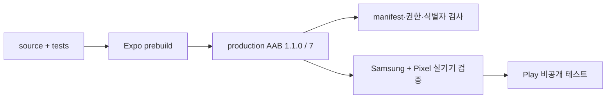

# 생활후견 AI 모바일 배포 가이드

이 문서는 `apps/mobile` Expo 앱의 현재 비공개 테스트 준비 범위와 Android·iOS 빌드 경로를 설명합니다. 과거 제품 자료는 현재 제출 근거가 아니며 이 문서에서 인용하지 않습니다.

## 현재 대상

| 항목 | 값 |
|---|---|
| 표시명 | `생활후견 AI` / `Life Steward AI` |
| Android 버전 | `1.1.0` / `versionCode 7` |
| package | `com.sinmb.careguardianai` (기존 식별자 유지) |
| EAS slug / project ID | `careguardian-ai-mobile` / `15b9e293-b631-4b77-8cfc-9937cd604dd4` |
| Play 위치 | Productivity, 타깃 연령 18세 이상, 기능 제한형 로컬 문서 정리 도구 (IARC 콘텐츠 등급은 설문 후 확정) |
| 테스트 데이터 | 합성·비민감 생활 일정과 메모만 허용 |


```mermaid
flowchart LR
  Source["source + tests"] --> Prebuild["Expo prebuild"]
  Prebuild --> AAB["production AAB 1.1.0 / 7"]
  AAB --> Static["manifest·권한·식별자 검사"]
  AAB --> Device["Samsung + Pixel 실기기 검증"]
  Device --> Play["Play 비공개 테스트"]
```

## 구현된 경계

- 개인 작업공간은 SQLCipher에 저장하고, 키는 SecureStore/Android Keystore 경계에 둡니다.
- 기기 인증, 백그라운드 잠금, 화면 캡처 차단, Android 백업 비활성화를 사용합니다.
- 로컬 알림은 기기에서만 예약합니다. 표시 제목은 일반 문구이며 data payload에는 `taskId`만 둡니다.
- 계정, 광고, 분석 SDK, 원격 푸시, 연락처·위치·마이크·카메라·외부 저장소 권한을 사용하지 않습니다.
- 로컬 AI는 고정 Hugging Face GGUF 파일을 사용자가 선택 설치한 뒤 기기 CPU에서 실행합니다. 설치 요청에서는 IP 주소와 일반 네트워크 메타데이터가 호스트에 보일 수 있으며, 프롬프트와 출력은 전송하지 않습니다.
- 전체 삭제는 실행 중인 추론 중지, 일반 알림 취소, 모델·부분 파일, SQLCipher 작업공간, SecureStore 키, 메모리 초기화를 순서대로 수행합니다.

## 로컬 도구와 명령

```powershell
$env:ANDROID_HOME="$env:LOCALAPPDATA\Android\Sdk"
$env:JAVA_HOME="C:\Program Files\Android\Android Studio\jbr"
$env:Path="$env:ANDROID_HOME\platform-tools;$env:ANDROID_HOME\emulator;$env:JAVA_HOME\bin;$env:Path"

npm ci
npm test -- --run
npm run build
npm run mobile:typecheck
```

`npm run mobile:android:go`는 웹·UI 빠른 확인용입니다. SQLCipher, 기기 인증, 일반 알림, 로컬 AI는 개발 빌드(`npm run mobile:android:dev`) 또는 production AAB에서 검증해야 합니다. Windows에서는 iOS 시뮬레이터를 실행할 수 없으므로 iOS는 EAS와 TestFlight를 별도 경로로 다룹니다.

## production AAB

```powershell
cd apps/mobile
npx eas-cli build --platform android --profile production --non-interactive
```

Task 10에서 새 AAB의 package, versionName, versionCode, target SDK, 64비트 ABI, `allowBackup=false`, 불필요 권한 부재를 확인하고 SHA-256을 기록합니다. Data safety 최종값은 그 AAB와 Samsung/Pixel 실기기 네트워크 관찰 후에만 확정합니다.

## 스크린샷과 Play 자산

`docs/screenshots/`에는 웹 PWA의 실제 렌더를 기준으로 한 아래 합성 데이터 자산을 둡니다. 이는 레이아웃·문구 검토용 **잠정 자산이며 Play 업로드 후보가 아닙니다.** 웹 화면의 “이 브라우저” 문구를 Android 앱 화면으로 오인해서는 안 됩니다.

| 파일 | 크기 | 용도 |
|---|---:|---|
| `feature-graphic.png` | 1024×500 | 무문자 feature graphic |
| `phone-screenshot-{1-4}.png` | 1080×1920 | phone 스크린샷 4장 |
| `tablet7-screenshot-{1-2}.png` | 900×1536 | 7-inch tablet 2장 |
| `tablet10-screenshot-{1-2}.png` | 1600×2560 | 10-inch tablet 2장 |

재생성은 `npm run build` 뒤 `npx vite preview --port 4173`와 별도 터미널의 `node scripts/capture-screenshots.mjs`로 수행합니다. 스크립트는 phone을 1080×1920 9:16, tablet을 2:1 이하, 8-bit opaque RGB, 각 8MB 이하로 검사합니다. 현재 캡처는 웹 PWA 실제 렌더입니다. **Task 10에서 Android Expo 앱을 에뮬레이터 또는 실기기에서 재캡처해 동일 파일을 최종 교체하는 것이 출시 차단 게이트입니다.**

## 출시 전 남은 외부 게이트

1. Task 10의 native prebuild, production AAB, 정적 검사와 Samsung·Pixel 검증
2. 모델 다운로드를 포함한 실기기 네트워크 관찰
3. Play Console에서 Productivity, 타깃 연령, 최신 문안·자산·AAB로 이전 대기 변경을 교체
4. 최종 Data safety 답변 확정과 비공개 테스트 opt-in 운영
5. Android Expo 실제 화면으로 Play 자산을 재캡처·교체하고 업로드 전 확인

현재 준비도는 [2026-07-30 준비도 기록](./security/private-test-readiness-2026-07-30.md)을 따릅니다.
