# Life Steward AI security and release gate

## Release decision

The current source tree is a non-medical, local-first personal workspace. This source gate must pass before a build can be considered for a private test or release. Synthetic closed-test submission and operation also require a final AAB, static AAB inspection, Android-native screenshots, and Play Console reconciliation. Samsung/Pixel physical-device evidence is collected during the synthetic closed test; it gates real personal/sensitive data and general release, not submission or start of that synthetic test.

```mermaid
flowchart LR
  A["npm ci"] --> B["tests + web build"]
  B --> C["CSP on every generated HTML"]
  C --> D["non-medical + model policy"]
  D --> E["gate mutation tests"]
  E --> F["exact production audit baseline"]
  F --> G["same-SHA Pages artifact"]
  G --> H["final AAB + static inspection"]
  H --> I["Android-native assets + Console reconciliation"]
  I --> J["synthetic closed test"]
  J --> K["Samsung/Pixel evidence"]
  K --> L["real data + general release review"]
```



## Full deletion inventory

The mobile full-delete action stops active local inference, removes every scheduled notification, removes installed model and partial files, then verifies deletion of each mobile persistence namespace before resetting in-memory UI state. It attempts every independent data domain even if an earlier domain fails, but never hides a failure: it returns an `AggregateError` containing typed `MobileFullDeletionError` and `MobileDataDeletionError` namespaces, and the UI remains locked on that path.

| Namespace | Current | Legacy health-era cleanup |
|---|---|---|
| SQLite/SQLCipher | `life-steward-workspace-encrypted.db`, `personal_workspaces` | `careguardian-caremanual-encrypted.db`, historical `care_manuals` |
| SecureStore | workspace context, creation marker, database key | CareGuardian context and database key |
| Expo SQLite KV store | none | `careguardian.mobile.manual` plaintext key |
| Notifications | all app-scheduled entries | all legacy medication identifiers as part of the empty-scheduler assertion |
| Local AI | installed GGUF, partial files, model workspace state | same models-root cleanup applies to prior installations |
| Process memory | workspace/UI state and inference context | reset after persistent cleanup succeeds |

Android notification channels are configuration rather than stored notification content; scheduled notifications are cancelled and the native scheduler is asserted empty. OS-level secure hardware key material is never exported by SecureStore and is destroyed by deleting its app-owned entries.

The web deletion inventory is deliberately narrower than the browser origin:

| Browser storage | App-owned deletion target | Verification |
|---|---|---|
| IndexedDB | database `life-steward-workspace`, store `workspaces`, record `current` | replace user content with the data-free `{type:"cleared"}` tombstone |
| Current localStorage | `life-steward.workspace.v1` | remove and immediately read back as absent |
| Legacy localStorage | `careguardian.manual` | remove and immediately read back as absent |
| Service-worker caches | none | the Vite PWA caches build assets, not workspace/user records; unrelated origin caches are not deleted |

Deletion returns failure when IndexedDB is blocked, localStorage raises `SecurityError`, or an app-owned legacy key is recreated before verification. The tombstone prevents a stale tab from restoring a prior revision and causes a later reload to retry legacy-key cleanup. Unrelated origin keys and caches are outside this app's authority and remain untouched.

The mobile controller resets in-process copies even when a persistent deletion domain fails, but it records the typed failed domains, keeps the privacy gate locked, and never shows the success message. The Alert callback observes and catches the controller rejection; the visible typed failure state is the source of truth.

## Device authentication

The lock invokes `expo-local-authentication` with `disableDeviceFallback: false`. It deliberately does not reject based on `hasHardwareAsync()`: Android PIN/pattern/password credentials may be usable without enrolled biometric hardware. A failed prompt or thrown native error remains locked. The synthetic closed test must collect PIN-only-path evidence on Samsung and Pixel hardware before any real personal/sensitive-data phase or general release.

## Static web protections

GitHub Pages cannot set repository-defined response headers. The Vite entry document therefore carries a first-in-head CSP meta policy:

```text
default-src 'self'; base-uri 'none'; object-src 'none'; script-src 'self'; style-src 'self'; img-src 'self' data:; connect-src 'self'; font-src 'self'; worker-src 'self'; manifest-src 'self'; form-action 'none'
```

This rejects remote AI/model endpoints from the PWA, arbitrary navigation forms, plugin scripts, `eval`, inline scripts/styles/event handlers, and objects. `public/privacy-policy.html` uses the same CSP and a self-hosted external stylesheet. `release:static-security-check` recursively inspects every generated `dist/**/*.html`, including `dist/privacy-policy.html`; deployment can upload only the artifact that passed this check. Meta CSP cannot provide `frame-ancestors`, so the source does not claim an HTTP header that GitHub Pages cannot deploy.

## Commands

```powershell
npm run release:policy-check
npm run release:model-check
npm run build
npm run release:static-security-check
npm run release:gate-tests
npm run release:audit-policy
npm run release:workflow-check
npm run verify
```

`release:policy-check` inventories tracked and non-ignored untracked runtime/release surfaces. It has no whole-file policy exceptions: each intentional denial term, legacy deletion constant, cloud-disable metadata line, and approved network call is an exact single-occurrence contract. It requires the fixed app identity, version, package, EAS project linkage, `allowBackup=false`, and the sole `POST_NOTIFICATIONS` permission. It blocks retired care-core imports, active health-shaped functionality, accounts, ads, analytics, cloud AI, remote push, unexpected mobile dependencies, unapproved network APIs, and literal/computed/template/concatenated remote URLs outside the fixed registry.

`release:model-check` parses strict `model-registry.json`, rejects comments and duplicate keys, and compares exact keys, types, object count, values, and URL multiset to the approved registry. The TypeScript runtime validates and deep-freezes this structured data before exporting it; `getInstallableModels()` returns only the frozen installable filter. The gate rejects duplicate runtime declarations, getter/filter bypasses, and computed/template/concatenated URLs. Only the two fixed HyperCLOVA X GGUF artifacts are installable. The unapproved Kakao entry stays blocked and cannot expose a download URL.

`release:gate-tests` runs mutation tests for all-HTML CSP, policy/legacy line contracts, dynamic network surfaces, model registry and runtime derivation, audit equality/error paths, and workflow dependency/action-pin rules.

## Audit risk acceptance: temporary and fail-closed

On 2026-07-30, `npm audit --omit=dev` reported **Critical 0, High 19, Moderate 10**. The accepted baseline is encoded in `scripts/audit-risk-acceptance.json`, owned by `sinmb79`, with a scheduled re-review date of **2026-08-06** and automatic expiry on **2026-08-13**. The gate validates both as real ISO calendar dates and requires `reviewDate <= expiresOn`; the review date is an operational checkpoint while `expiresOn` is the automatic fail boundary. `release:audit-policy` reruns npm audit and requires exact sorted equality of severity counts, package names, and GHSA IDs. Missing or replacement advisories fail just like new advisories. Invalid JSON, registry/network command errors, signals, unexpected exit codes, malformed acceptance data, and expiry all fail closed.

The current chains are Expo/React Native build and tooling dependencies: Expo CLI/config/prebuild/Metro, React Native codegen/community CLI/dev middleware, Babel/Jest test transform, and glob/minimatch/rimraf/postcss/tar/xcode/uuid transitives. Identified GHSA references are `GHSA-6g55-p6wh-862q`, `GHSA-mh99-v99m-4gvg`, `GHSA-qx2v-qp2m-jg93`, `GHSA-r28c-9q8g-f849`, `GHSA-r292-9mhp-454m`, and `GHSA-w5hq-g745-h8pq`.

No claim is made that these findings are harmless or unreachable in a production AAB. Their AAB reachability remains unproven until the final artifact is inspected. The mitigation is bounded acceptance plus reproducible lockfile installs, pinned GitHub Actions, release/model policy gates, and mandatory final-AAB review before synthetic closed-test submission; upgrading Expo or React Native major versions is intentionally out of scope for this gate. Samsung/Pixel evidence is then collected during that test and must be complete before real personal/sensitive data or general release.

## Same-SHA Pages deployment

`.github/workflows/ci.yml` is the only workflow. Its `verify` job checks out `${{ github.sha }}`, installs the lockfile, runs unit tests, build, every static/mobile/policy/model/mutation/audit/workflow gate, and only then uploads `dist`. `deploy` depends directly on `verify` and deploys that artifact without another checkout or rebuild. The workflow default is `contents: read`; only the deploy job receives `pages: write` and `id-token: write`. Every third-party Action is pinned to a full commit SHA.
