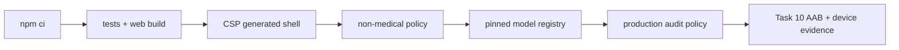

# Life Steward AI security and release gate

## Release decision

The current source tree is a non-medical, local-first personal workspace. This gate must pass before a build is accepted for a private test or release. It is not a substitute for the Task 10 Android AAB inspection and real-device test.



## Full deletion inventory

The mobile full-delete action stops active local inference, removes every scheduled notification, removes installed model and partial files, then verifies deletion of each mobile persistence namespace before resetting in-memory UI state. It attempts every independent data domain even if an earlier domain fails, but never hides a failure: it returns an `AggregateError` containing typed `MobileFullDeletionError` and `MobileDataDeletionError` namespaces, and the UI remains locked on that path.

| Namespace | Current | Legacy health-era cleanup |
|---|---|---|
| SQLite/SQLCipher | `life-steward-workspace-encrypted.db`, `personal_workspaces` | `careguardian-caremanual-encrypted.db`, historical `care_manuals` |
| SecureStore | workspace context, creation marker, database key | CareGuardian context and database key |
| Expo SQLite KV store | none | `careguardian.mobile.manual` plaintext key |
| Notifications | all app-scheduled entries | all legacy medication identifiers as part of the empty-scheduler assertion |
| Local AI | installed GGUF, partial files, model workspace state | same models-root cleanup applies to prior installations |
| Process memory | workspace/UI state and inference context | reset after persistent cleanup succeeds |

Android notification channels are configuration rather than stored notification content; scheduled notifications are cancelled and the native scheduler is asserted empty. OS-level secure hardware key material is never exported by SecureStore and is destroyed by deleting its app-owned entries.

## Device authentication

The lock invokes `expo-local-authentication` with `disableDeviceFallback: false`. It deliberately does not reject based on `hasHardwareAsync()`: Android PIN/pattern/password credentials may be usable without enrolled biometric hardware. A failed prompt or thrown native error remains locked. Task 10 still must prove the PIN-only path on Samsung and Pixel hardware.

## Static web protections

GitHub Pages cannot set repository-defined response headers. The Vite entry document therefore carries a first-in-head CSP meta policy:

```text
default-src 'self'; base-uri 'none'; object-src 'none'; script-src 'self'; style-src 'self'; img-src 'self' data:; connect-src 'self'; font-src 'self'; worker-src 'self'; manifest-src 'self'; form-action 'none'
```

This rejects remote AI/model endpoints from the PWA, arbitrary navigation forms, plugin scripts, `eval`, inline scripts, and objects. `release:static-security-check` inspects generated `dist/index.html`; deployment runs it after the Pages build. Meta CSP cannot provide `frame-ancestors`, so the source does not claim an HTTP header that GitHub Pages cannot deploy.

## Commands

```powershell
npm run release:policy-check
npm run release:model-check
npm run build
npm run release:static-security-check
npm run release:audit-policy
npm run verify
```

`release:policy-check` uses `git ls-files` and checks only tracked runtime/release surfaces, excluding narrow and documented policy enforcement, legacy-deletion compatibility, test, history, and license paths. It requires the fixed app identity, version, package, EAS project linkage, `allowBackup=false`, and the sole `POST_NOTIFICATIONS` permission. It blocks retired care-core imports, active health-shaped functionality, accounts, ads, analytics, cloud AI, remote push, unexpected mobile dependencies, and remote runtime URLs outside the fixed registry.

`release:model-check` accepts only the two fixed HyperCLOVA X GGUF artifacts: official Hugging Face owner/repository, 40-hex revision, exact filename, bytes, SHA-256, RAM/context gates, attribution, and locally bundled license assets. The unapproved Kakao entry stays blocked and cannot expose a download URL.

## Audit risk acceptance: temporary and fail-closed

On 2026-07-30, `npm audit --omit=dev` reported **Critical 0, High 19, Moderate 10**. The accepted baseline is encoded in `scripts/audit-risk-acceptance.json`, owned by `sinmb79`, with review on **2026-08-06** and automatic expiry on **2026-08-13**. `release:audit-policy` reruns npm audit and fails on any critical finding, count/package baseline change, newly identified GHSA advisory, or expiry.

The current chains are Expo/React Native build and tooling dependencies: Expo CLI/config/prebuild/Metro, React Native codegen/community CLI/dev middleware, Babel/Jest test transform, and glob/minimatch/rimraf/postcss/tar/xcode/uuid transitives. Identified GHSA references are `GHSA-6g55-p6wh-862q`, `GHSA-mh99-v99m-4gvg`, `GHSA-qx2v-qp2m-jg93`, `GHSA-r28c-9q8g-f849`, `GHSA-r292-9mhp-454m`, and `GHSA-w5hq-g745-h8pq`.

No claim is made that these findings are harmless or unreachable in a production AAB. Their AAB reachability remains unproven until Task 10 inspects the built artifact. The mitigation is bounded acceptance plus reproducible lockfile installs, pinned GitHub Actions, release/model policy gates, and mandatory AAB review; upgrading Expo or React Native major versions is intentionally out of scope for this gate.
