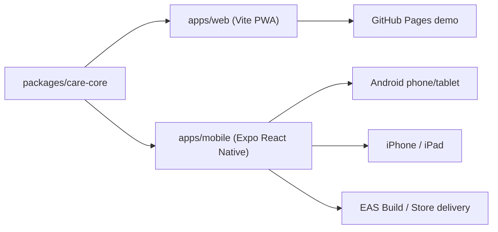

# CareGuardian Mobile Delivery Design

> Goal: turn the current PWA prototype into a production-ready cross-platform product line that can ship to Android phones, Android tablets, iPhone, and iPad while preserving the existing web experience.

## 1. Product Direction

한국어: 현재 웹 PWA는 개념 검증에는 충분하지만, 실제 배포를 위해서는 네이티브 알림, 안전한 로컬 저장, 음성 입출력, 오프라인 동작, 스토어 배포 경로가 필요합니다. 그래서 웹을 폐기하지 않고 `웹 + 모바일 앱` 이중 체계로 확장합니다.

English: The current web PWA is sufficient for validation, but real distribution requires native notifications, secure local storage, speech I/O, offline resilience, and app-store delivery. We will keep the web app and extend it into a `web + mobile app` product line.

## 2. Recommended Architecture

한국어: 권장 구조는 `Expo 기반 React Native 앱 + 공용 TypeScript 코어 패키지 + 기존 Vite 웹 앱 유지`입니다. 공용 코어에는 매뉴얼 스키마, 일정 생성, 복약 타임라인, 릴레이 패키지, 동반자 응답 로직을 모읍니다. 웹과 모바일은 각 플랫폼 전용 저장소, 음성, UI 레이어만 따로 둡니다.

English: The recommended structure is `an Expo-based React Native app + a shared TypeScript core package + the existing Vite web app`. The shared core will own the manual schema, schedule generation, medication timeline, relay package logic, and companion reply logic. Web and mobile will keep platform-specific storage, speech, and UI layers separate.

## 3. Platform Choices

| Area | Choice | Why |
|---|---|---|
| Mobile runtime | Expo SDK 55 line | Fast Android setup, iOS cloud builds from Windows, stable native APIs |
| Secure local storage | `expo-secure-store` for secrets + `expo-sqlite` for manual cache | Safer than plain localStorage and usable offline |
| Notifications | `expo-notifications` | Native local notifications and future push path |
| Voice output | `expo-speech` | Stable built-in TTS path |
| Voice input | abstraction layer with device/native provider fallback | Android can be validated first; iOS support may differ by provider |
| Distribution | GitHub Pages for web, EAS Build for mobile | Works from Windows, supports Android + iOS store artifacts |

## 4. Constraints

한국어: 이 작업 환경은 Windows이므로 Android 에뮬레이터는 로컬 검증이 가능하지만, iOS 시뮬레이터는 macOS와 Xcode가 없으면 직접 실행할 수 없습니다. 따라서 iOS는 `코드 작성 + 공용 로직 검증 + EAS 빌드/원격 Mac 검증 준비`까지가 로컬 한계입니다.

English: This environment is Windows, so Android emulator verification is possible locally, but the iOS simulator cannot run without macOS and Xcode. Therefore, the local ceiling for iOS is `code implementation + shared logic validation + EAS build / remote Mac verification readiness`.

## 5. Delivery Stages

1. 한국어: 도메인 로직을 `packages/care-core`로 이동합니다.  
   English: Move domain logic into `packages/care-core`.
2. 한국어: 현재 웹 앱을 `apps/web`로 정리하고 공용 코어를 참조하도록 바꿉니다.  
   English: Rehome the web app under `apps/web` and point it at the shared core.
3. 한국어: `apps/mobile` Expo 앱을 생성하고 보호자/동반자 흐름의 첫 버전을 구현합니다.  
   English: Create `apps/mobile` with Expo and implement the first caregiver/companion flow.
4. 한국어: Android 에뮬레이터에서 입력, 저장, 일정, 복약, 음성, 알림을 검증합니다.  
   English: Verify input, persistence, schedule, medication, speech, and notifications on an Android emulator.
5. 한국어: EAS 설정과 앱스토어 제출 문서를 작성합니다.  
   English: Add EAS configuration and app-store delivery docs.

## 6. Claude Code Collaboration

한국어: Claude Code는 설계 검토, UI 카피 다듬기, 테스트 케이스 확장, 스토어 문구 검토에 투입하기 좋습니다. Codex는 실제 구조 변경, 도구 설치, 로컬 실행, 빌드, 배포 스크립트를 담당합니다.

English: Claude Code is well suited for design review, UX copy refinement, test-case expansion, and store-copy review. Codex will handle structural changes, tool installation, local execution, builds, and deployment scripts.

## 7. Success Criteria

| Check | Definition |
|---|---|
| Shared core | Web and mobile both import the same manual/schedule/reminder/relay logic |
| Android local test | App launches in an Android emulator and the core caregiver/companion flow works |
| iOS readiness | EAS iOS build config exists and the app is ready for cloud or remote-Mac verification |
| Docs | README explains web/mobile/dev/deploy paths in Korean first, then English |
| Safety | No secrets committed; platform setup is scriptable and documented |
