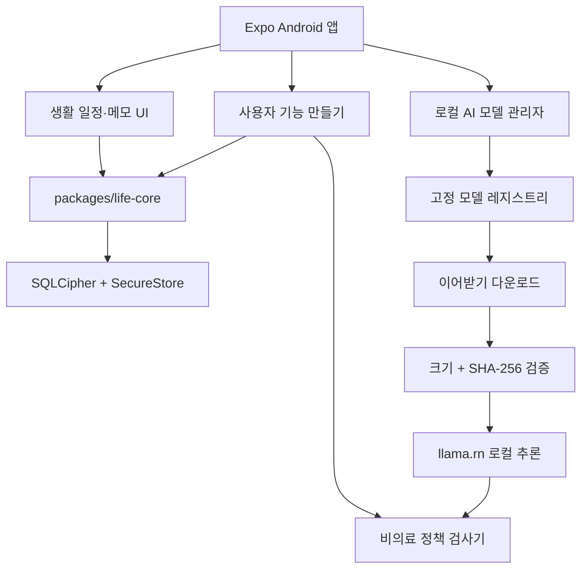
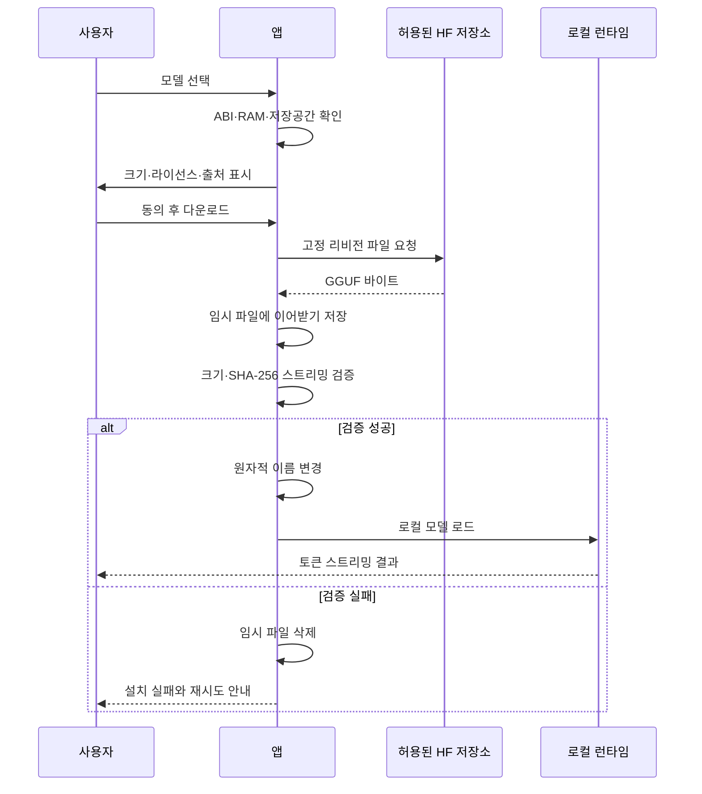

# 생활후견 AI 비의료 전환 및 모바일 로컬 AI 설계

- 작성일: 2026-07-30
- 대상: 기존 Google Play 앱 `com.sinmb.careguardianai`
- 제품명: `생활후견 AI` (`Life Steward AI`)
- 상태: 보스가 권장안과 아키텍처·데이터 흐름을 승인했고, 남은 세부 판단은 줄리아에게 위임함

## 1. 목표

현재 CareGuardian AI의 건강·복약 중심 기능을 실제 코드와 배포물에서 제거하고, 개인 개발자 계정으로 정직하게 배포할 수 있는 비의료 생활 정리 앱으로 전환한다.

새 앱은 사용자가 일반 일정·할 일·메모·체크리스트를 직접 구성하고, 검증된 소형 한국어 모델을 선택적으로 내려받아 기기 안에서 문서 정리 작업에 사용하는 로컬 우선 도구다.

비공개 테스트 완료의 정의는 다음과 같다.

1. Android 바이너리, UI, 기본 데이터, 문서, 개인정보처리방침, 스토어 등록정보에서 건강·복약·진단·치료 기능이 제거된다.
2. 사용자 정의 기능은 선언형 스키마로만 동작하고 임의 코드·웹훅·외부 플러그인을 실행하지 않는다.
3. 로컬 AI는 사용자가 명시적으로 설치하며 사용자 본문과 생성 결과를 외부 AI 서버로 보내지 않는다.
4. NAVER 0.5B와 1.5B GGUF는 리비전·크기·SHA-256을 고정한 허용 목록으로 제공한다.
5. Kakao Kanana 1.5 2.1B는 공식 모바일 GGUF 또는 검증된 재현 가능 변환본이 확보될 때까지 목록에 보이되 설치는 차단한다.
6. 자동·네이티브·보안 검증을 통과한 새 production AAB를 기존 Play 비공개 테스트 트랙에 업로드하고, 건강형 이전 변경을 새 비의료 변경으로 완전히 대체한다.

## 2. 비목표

- 복약, 투약, 증상, 질환, 알레르기, 진단, 치료, 재활, 건강 측정 기능
- 의료 기능을 일반 기능으로 숨기거나 간접 사례로 유도하는 방식
- 응급 호출, 의료 상담, 심리 상담, 보호자 자동 연락
- 클라우드 AI, 계정 로그인, 광고, 분석 SDK, 원격 텔레메트리
- 사용자가 임의 URL의 모델·스크립트·플러그인을 실행하는 기능
- 공개 기능팩·프롬프트·모델 마켓과 사용자 간 공유
- 기존 건강형 데이터 또는 백업의 자동 마이그레이션
- PC용 로컬 모델 실행과 iOS 배포

## 3. 선택한 접근

### 3.1 같은 Play 앱을 정직하게 전환

기존 패키지와 EAS 프로젝트는 유지한다. 새 앱을 만들어 과거 건강 심사 이력을 우회하지 않는다. 대신 `versionCode 6` 건강형 AAB를 폐기하고, 새 비의료 코드·스토어 정보·개인정보처리방침·Health 선언을 하나의 변경 묶음으로 제출한다.

기존 건강형 문서와 감사 기록은 역사 자료로 보존하되, 현재 출시 문서에서는 이전 빌드임을 명확히 표시한다.

### 3.2 검증된 모델 목록과 선언형 기능 생성

첫 버전은 앱에 포함된 정적 모델 레지스트리와 제한된 사용자 기능 스키마만 지원한다. 임의 GGUF 가져오기와 공개 마켓은 후속 버전으로 미룬다.

이 방식은 모델 공급망, 라이선스, 다운로드 무결성, 앱 심사 범위를 통제하면서도 사용자가 자신의 생활 기능을 직접 만들 수 있게 한다.

## 4. 제품 경계와 기본 경험

앱 표시명은 `생활후견 AI`이며 스토어 카테고리는 실제 Play 선택지에 따라 `Productivity`를 우선 사용한다.

짧은 설명의 기준 문구는 다음과 같다.

> 기기 안에서 일정·메모·체크리스트를 정리하고 나만의 기능을 만드는 로컬 AI 도구

기본 제공 사용사례는 다음으로 제한한다.

- 오늘 할 일
- 가사와 생활 루틴
- 외출 준비물
- 문서 위치 메모
- 연락 기록
- 일반 일정과 마감일

사용자가 자유 메모에 어떤 내용을 적는지는 검사하거나 서버로 보내지 않는다. 다만 앱은 건강 관련 내용을 구조화된 필드·템플릿·자동화·AI 작업으로 승격하지 않는다.

## 5. 아키텍처

### 5.1 `packages/life-core`

기존 `packages/care-core`를 새 출시 경로에서 제거하고 중립적인 공용 코어로 교체한다.

공용 코어의 책임:

- `PersonalWorkspace`
- `LifeList`
- `LifeRecord`
- `Task`
- `Reminder`
- `FieldDefinition`
- `ExtensionDefinition`
- 스키마 검증과 버전 마이그레이션
- 의료 의도 검사

웹과 모바일은 이 코어를 공유하되, 저장소·알림·로컬 AI 런타임은 플랫폼 계층에 둔다.

### 5.2 모바일 계층

- `workspace`: 암호화 저장·로드·전체 삭제
- `extensions`: 기능 만들기·미리보기·활성화
- `notifications`: 일반 일정 알림 생성·취소
- `local-ai`: 레지스트리·다운로드·검증·추론·삭제
- `policy`: 기능 메타데이터와 AI 입력·출력 검사
- `legal`: 모델 라이선스·NOTICE·출처·사용 조건

각 계층은 명시적 타입 인터페이스로 연결하고, 로컬 AI가 설치되지 않아도 생활 관리 기능은 완전히 동작해야 한다.

## 6. 사용자 기능 스키마

지원 필드:

- `text`
- `longText`
- `number`
- `date`
- `time`
- `choice`
- `boolean`
- `fileReference`

지원 트리거:

- `manual`
- `scheduled`
- `fieldChanged`

지원 동작:

- `showNotification`
- `createTask`
- `copyText`

지원 AI 동작:

- `summarize`
- `rewriteText`
- `suggestTitle`
- `draftChecklist`

URL 호출, 외부 앱 자동 실행, 동적 JavaScript, 네이티브 코드, 셸 명령, 원격 프롬프트, 백그라운드 업로드는 스키마에 존재하지 않는다.

기능 이름·설명·필드 라벨·선택지·자동화 제목·AI 작업 지시에 건강 의도가 감지되면 저장 전에 차단하고 일반 생활 관리 용도로 다시 작성하도록 안내한다.

## 7. 로컬 AI 모델 레지스트리

### 7.1 NAVER HyperCLOVA X SEED 0.5B

| 항목 | 값 |
|---|---|
| 용도 | 4GB 이상 기기의 경량 모드 |
| 저장소 | `naver-ellm/HyperCLOVAX-SEED-Text-Instruct-0.5B-GGUF` |
| 리비전 | `27831169fdebe6fe30bb1b9d76b12a2d06693f26` |
| 파일 | `HyperCLOVAX-SEED-Text-Instruct-0.5B-Q4_K_M.gguf` |
| 크기 | `431882784` bytes |
| SHA-256 | `bc6a93b452648e8e90b06dc04f81edbdce9703fa76bdf589a63cc8418699d44f` |
| 최대 문맥 | 4096 |
| 모바일 기본 문맥 | 2048 |

### 7.2 NAVER HyperCLOVA X SEED 1.5B

| 항목 | 값 |
|---|---|
| 용도 | 6GB 이상 기기의 균형 모드 |
| 저장소 | `naver-ellm/HyperCLOVAX-SEED-Text-Instruct-1.5B-GGUF` |
| 리비전 | `b9bbb68d6635a8b80263bf7165c8b908d64f28de` |
| 파일 | `HyperCLOVAX-SEED-Text-Instruct-1.5B-Q4_K_M.gguf` |
| 크기 | `1006572160` bytes |
| SHA-256 | `6e0841f886f55411327d4659308f2408424f0ac55a2d32f60a49f470c71381a6` |
| 최대 문맥 | 16384 |
| 모바일 기본 문맥 | 4096 |

NAVER 원본 저장소와 GGUF 배포 채널이 다르므로 앱은 공급망 상태를 정확히 설명한다. 리비전과 LFS SHA-256을 고정하고, 일반 공개 출시 전에는 NAVER Cloud에 `naver-ellm` 변환본의 배포 지위를 서면 확인한다.

### 7.3 Kakao Kanana 1.5 2.1B

공식 모델 저장소는 `kakaocorp/kanana-1.5-2.1b-instruct-2505`, 리비전은 `7df4bc35ccd610e451809d7106e1c3cf82bfd44c`, 라이선스는 Apache-2.0이다.

공식 Q4 GGUF가 없으므로 첫 비공개 테스트에서는 모델 설명과 요구 사양만 표시하고 다운로드 버튼은 `검증 준비 중`으로 비활성화한다. 공식 GGUF 또는 공식 가중치에서 재현 가능하게 만든 내부 승인 변환본과 SHA-256이 확보되면 별도 공급망 검토 후 활성화한다.

## 8. 모델 다운로드와 추론 흐름

모델 파일은 캐시가 아닌 앱 전용 문서 저장소에 둔다. 32비트 ABI에서는 AI 기능을 노출하지 않는다. 첫 버전은 CPU 추론만 지원하고 OpenCL·NPU 가속은 사용하지 않는다.

동시에 하나의 모델과 하나의 생성만 허용한다. 앱이 백그라운드로 이동하거나 잠기면 생성을 중지하고 컨텍스트를 해제한다. 출력 길이 제한, 취소 버튼, 문맥 상한, 발열 경고를 제공한다.

## 9. AI 안전 경계

AI는 문서 정리 도구이며 판단 주체가 아니다.

입력 전 검사:

- 건강, 약물, 증상, 진단, 치료, 응급, 심리상담 의도 차단
- 선택된 일반 메모만 프롬프트에 포함
- 다른 작업공간이나 숨겨진 필드 자동 주입 금지

출력 후 검사:

- 건강 조언·투약·진단·치료·응급 지시 차단
- 일정이나 작업을 자동 저장하지 않고 미리보기 제공
- 사용자가 명시적으로 승인한 결과만 저장

차단 응답:

> 이 앱의 AI는 건강, 약물, 증상, 진단, 치료 또는 응급상황에 관한 정보·권고·일정 생성을 제공하지 않습니다. 일반 일정·메모·체크리스트 정리는 도와드릴 수 있습니다.

AI 결과에는 `문제 신고`와 `삭제`를 제공한다. 신고는 기본적으로 원문을 전송하지 않으며, 첫 비공개 테스트에서는 기기 안의 로컬 피드백 기록으로만 저장한다.

## 10. 저장·보안·개인정보

- 일반 메모와 기능 정의는 SQLCipher 데이터베이스에 저장한다.
- 데이터베이스 키는 SecureStore와 Android Keystore로 분리한다.
- Android 백업은 비활성화 상태를 유지한다.
- 화면 캡처 차단, 백그라운드 잠금, 기기 인증을 유지하되 문구를 일반 개인정보 보호로 바꾼다.
- 모델 설치 메타데이터와 라이선스 동의 기록은 사용자 본문과 분리한다.
- 모델 파일, 부분 다운로드, 작업공간, 키를 각각 삭제할 수 있다.
- `모든 로컬 데이터 삭제`는 추론 중지, 모델·부분 파일 삭제, 알림 취소, DB 삭제, 키 삭제, 메모리 초기화를 검증 가능한 순서로 수행한다.
- 광고 ID, 연락처, 위치, 마이크, 카메라, SMS, Health Connect, 외부 저장소 권한을 요청하지 않는다.
- 모델 다운로드 외에는 사용자 데이터 네트워크 전송 경로를 만들지 않는다.

## 11. 라이선스 표시

NAVER 모델을 활성화하면 다음을 제공한다.

- 다운로드 전 HyperCLOVA X SEED 라이선스와 금지 사용 정책 동의
- 앱 이용약관에 금지 사용 정책을 구속력 있는 조항으로 포함
- 앱 내부에서 전체 라이선스와 NOTICE 오프라인 열람
- 모델 화면과 AI 결과 화면에 `Powered by HyperCLOVA X` 표시
- 저장소·리비전·파일명·크기·SHA-256 표시
- 월간 활성 사용자 1천만 명 초과 또는 NAVER 직접 경쟁 서비스 해당 시 별도 라이선스 게이트

Kanana가 활성화되는 후속 버전에서는 Apache-2.0 전문과 수정·변환 고지를 제공한다.

## 12. 오류 처리

| 오류 | 처리 |
|---|---|
| 지원하지 않는 ABI | AI 메뉴를 읽기 전용 안내 상태로 표시 |
| RAM 부족 예상 | 더 작은 모델 추천, 강제 실행 금지 |
| 저장공간 부족 | 필요한 여유 공간과 정리 방법 표시 |
| 다운로드 중단 | 부분 파일을 보존하고 명시적 이어받기 제공 |
| 크기·해시 불일치 | 파일 격리 없이 즉시 삭제, 실행 차단 |
| 모델 로드 실패 | 컨텍스트 해제 후 생활 관리 기능만 계속 제공 |
| 생성 취소·백그라운드 이동 | 토큰 생성 중지와 컨텍스트 해제 |
| 손상된 작업공간 | 안전한 오류 화면에서 삭제 또는 새 작업공간 선택 |
| 알림 예약 실패 | 성공으로 표시하지 않고 재시도 가능 상태 저장 |
| 의료 의도 감지 | 차단 문구와 허용된 일반 작업 예시 제공 |

## 13. 테스트 설계

### 13.1 자동 테스트

- life-core 스키마와 마이그레이션
- 기능 스키마 허용·거부 조합
- 의료 의도 정규화·우회 문자열 회귀
- 모델 레지스트리 리비전·크기·해시·라이선스 필수값
- 다운로드 상태 전이, 부분 파일, 재시도, 해시 불일치
- AI 입력·출력 차단과 사용자 승인 전 미저장
- 일반 일정 알림 생성·변경·취소·전체 삭제
- 건강·복약 문자열이 현재 출시 코드·기본 데이터·스토어 자료에 남지 않는지 검사
- 보안 삭제와 잠금 회귀

### 13.2 네이티브 검증

- x86_64 에뮬레이터: 설치, 시작, 저장, 삭제, 모델 미설치 경로
- arm64 실기기: 0.5B 다운로드·검증·로드·생성·취소·삭제
- 6GB 이상 실기기: 1.5B 동일 시나리오
- 네트워크 단절, 강제 종료, 재시작, 저장공간 부족
- 백그라운드 전환과 화면 잠금
- 20분 연속 생성 시 ANR·메모리·발열 관찰
- Samsung과 Pixel 각 1대 이상에서 최종 smoke

### 13.3 공급망·보안 검증

- `npm audit --omit=dev`
- Expo Doctor
- 비밀·위험 API·의료 문자열 정적 검사
- production AAB manifest와 권한 검사
- AD_ID·외부 저장소·디버그·개발 메뉴 부재 확인
- AAB에서 필요한 64비트 llama 네이티브 라이브러리 확인
- 앱 실행 중 모델 다운로드 이외 사용자 데이터 네트워크 전송 0건 확인
- AAB SHA-256, 소스 커밋, EAS build ID 보존

## 14. Play 비공개 테스트 전환

1. 앱 버전을 `1.1.0`, Android `versionCode`를 7 이상으로 올리고 native와 Expo 설정의 값을 일치시킨다.
2. 앱 표시명·설명·개인정보처리방침·스크린샷·feature graphic을 생활후견 AI에 맞게 교체한다.
3. 카테고리를 `Productivity`로 변경한다.
4. 실제 최종 바이너리에 건강 기능이 없음을 확인한 뒤 Health apps declaration을 비건강 앱 상태로 갱신한다.
5. Data safety는 최종 AAB와 네트워크 관찰 결과에 맞춰 다시 작성한다.
6. 기존 `1.0.1 (6)` 건강형 출시를 새 production AAB로 대체한다.
7. 게시 개요에서 `Medical`, 복약, 이전 건강 선언, 이전 스크린샷이 남은 변경을 모두 제거한다.
8. 기존 테스터 목록은 유지하고 새 출시 노트와 opt-in 설치 경로를 검증한다.
9. 검토에 제출한 뒤 정책·사전 출시 보고서와 설치 가능 상태를 확인한다.

출시 노트 기준 문구:

> 건강·복약 기능을 제거하고 일반 일정·메모·체크리스트 중심의 생활 관리 앱으로 전환했습니다. 사용자가 직접 생활 기능을 만들 수 있으며, 선택한 한국어 소형 모델은 기기 안에서만 실행됩니다.

## 15. 구현 분리

개발은 서로 독립적으로 검토 가능한 네 작업으로 나눈다.

1. 비의료 공용 코어와 웹·모바일 생활 관리 경험
2. 모델 레지스트리·다운로드·무결성·llama.rn 런타임
3. 정책 검사·라이선스·보안·삭제
4. 스토어 자산·production AAB·Play 비공개 테스트 업데이트

각 작업은 자체 테스트를 통과한 뒤 마지막 통합 단계에서만 합친다.

## 16. 최종 수용 기준

- `npm run verify` 통과
- 앱·웹 production build 통과
- 건강·복약 기능 코드와 현재 출시 문구 0건
- 사용자 기능 스키마 외 임의 실행 경로 0건
- NAVER 모델의 고정 리비전·크기·SHA-256 검증
- 모델 미설치 상태에서 앱 전체 생활 기능 정상
- 0.5B 실기기 로컬 생성 성공
- 전체 삭제 후 DB·키·모델·부분 파일·알림 잔존 0건
- production AAB `versionCode > 6`, target SDK 36, 불필요 민감 권한 0건
- 새 스토어 등록정보·개인정보처리방침·Data safety·Health 선언이 실제 AAB와 일치
- 새 AAB가 기존 Play 비공개 테스트 트랙에 저장되고 검토 제출 상태가 확인됨
